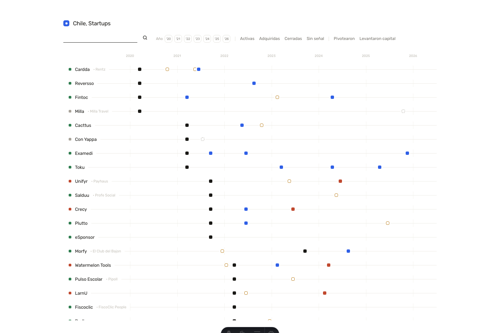

# Chile, Startups — trayectorias del portafolio Platanus

Dataset + visualización de **cómo evolucionaron las startups del portafolio de
[Platanus Ventures](https://platan.us)**: pivots de producto, rebrands, rondas de
inversión, adquisiciones y cierres, datados y con fuente.

Agrega **información pública de negocios** (sitios de las empresas, prensa, perfiles de
aceleradora, registros) para análisis de ecosistema. No publica datos personales ni privados.



## Cómo está armado

Dos piezas:

- **`web/`** — el sitio (Astro, CSS puro, UI en español). Renderiza una línea de tiempo
  donde cada startup muestra sus hitos, y cada hito enlaza a su fuente. El dato que consume
  es `web/src/data/timeline.json` (versionado).
- **`scraper/`** — el pipeline de datos (Python + `uv`). Reconstruye la trayectoria real de
  cada startup desde el archivo web y la lleva, ya verificada, a `timeline.json`.

### El pipeline (`scraper/`)

1. **Identidad** → cadena de dominios de cada startup (`identity.json`).
2. **Archivar** las superficies mensuales desde Wayback: las landings de cada marca y el
   perfil que la startup mantiene en el directorio del venture.
3. **Detectar fases** con la heurística de *title-timeline* (`title_timeline_audit.py`).
4. **Curar** los pivots/rebrands leyendo el **cuerpo completo** de cada snapshot, con
   disciplina de verificabilidad (cada hito necesita fuente datada).
5. **Construir** `timeline.json` (`build_pivots_curated.py` + `build_timeline.py`), garantizando
   que cada evento lleve `source_url`.

La metodología completa —y cómo aplicarla a **otro portafolio o venture**— está en
[`docs/METHODOLOGY.md`](docs/METHODOLOGY.md).

## Correr el proyecto

**Sitio:**
```bash
bun install
cd web && bun install && bunx astro dev      # http://localhost:4321
```

**Pipeline** (requiere [`uv`](https://docs.astral.sh/uv/)):
```bash
cd scraper
uv run python build_pivots_curated.py && uv run python build_timeline.py
cd ../web && bunx astro build
```

## Estructura

```
web/                 sitio Astro (timeline.json versionado)
scraper/             pipeline de datos (Python/uv)
docs/METHODOLOGY.md  el método para reconstruir trayectorias (reutilizable)
data/                dataset + archivos de Wayback — NO versionado, ver data/README.md
```

## Los datos

El dataset y los ~276 MB de capturas de Wayback **no se versionan** (`.gitignore`): se
regeneran corriendo el pipeline. Lo único que viaja en el repo es el resultado final que
el sitio renderiza (`web/src/data/timeline.json`). Detalle en
[`data/README.md`](data/README.md).

## Stack

Bun · Astro · CSS puro · Python + uv · scikit-learn (TF-IDF) · Wayback Machine API.
